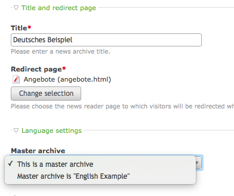

# ChangeLanguage v3

1. [Installation](01-installation.md)
2. [Basic configuration](02-basics.md)
3. [**Advanced configuration**](03-advanced.md)
4. [Backend tools](04-backend.md)
5. [Frontend module](05-frontend-module.md)
6. [Insert tags](06-inserttags.md)
7. [Developers](07-developers.md)
8. [Tips & FAQ](08-tips-faq.md)

## Language switching of Contao modules

If you have a multilingual website and use Contao news, calendar or faq module,
there's likely the same content available in multiple languages.

In ChangeLanguage v3, these Contao core modules are supported out-of-the-box.
Similar to pages, it's necessary to configure which content belongs together to
enable successful language switching in the front end.

### Configuring redirect page

Before you can link news archives, calendars or faq categories, make sure
to assign the correct *Redirect page* in the settings, and make sure these
redirect pages are linked together in the page tree.

### Linking parent (news archive / calendar / faq category)

Inside each archive configuration, you will find a select menu to
define if that archive is a master (default) or if it belongs to another
archive.

There can be an unlimited number of separate *groups*, e.g. multiple news
archives for different categories, each existing in multiple languages.

### Linking content (news, event, question)

Once you have successfully linked two or more archives together, each
news article will get a new select menu to choose the master language
version.

By default, news and events of the same day as the current one will appear
at the top to ease finding the relevant content.
