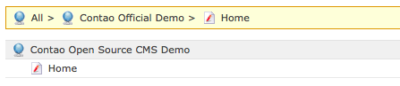
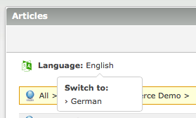
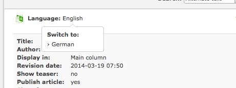

# ChangeLanguage v3

1. [Installation](01-installation.md)
2. [Basic configuration](02-basics.md)
3. [Advanced configuration](03-advanced.md)
4. [**Backend tools**](04-backend.md)
5. [Frontend module](05-frontend-module.md)
6. [Insert tags](06-inserttags.md)
7. [Developers](07-developers.md)
8. [Tips & FAQ](08-tips-faq.md)

## Switching the current language

With *ChangeLanguage* version 3, editing multilingual content in the
back end becomes a lot easier thanks to the language switching tool.

### In the page or article tree

By clicking on a page name in the back end page or article tree, Contao
will filter down the tree to the given node and show a breadcrumb menu.

If you filter for a page, *ChangeLanguage* will now enable you to easily
switch the node filter to the same page in a different language. This
is especially handy in the article tree to quickly edit the same articles
in multiple languages.

### In the content element list

The same language switching functionality is available in the list
of content elements when editing page articles.

For *ChangeLanguage* to find the correct article in a foreign language,
one of the following conditions must apply:

1. You have set up links between articles of the master page and its
   translations.
2. There is only one article in the target language page
3. There is only one article in the same column as the current article

If none of these matches, clicking the language will bring you to the
list of articles (article tree) with the target page node filter enabled.
