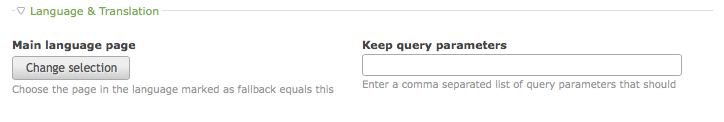
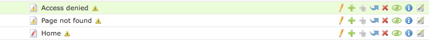

# ChangeLanguage v3

1. [Installation](installation.md)
2. [Linking pages](pages.md)
3. [Frontend module](frontend-module.md)
4. [Insert tags](inserttags.md)
5. [Tips & FAQ](tips-faq.md)

## Setting up root pages

In a regular Contao, you can have unlimited number of root pages, each
reflecting one domain and one language. If you have a multilingual website, you
must have multiple root pages with the same domain and different language
setting.

One root page per domain must be marked as *fallback* language. ChangeLanguage
will then automatically recognize all pages of the same domain are related to
each other.

### Multilingual website on multiple domains

ChangeLanguage also supports linking between multiple languages on different
domains. To know which domains belong to each other, you must manually configure
them. If a root page has the *fallback* checkbox set, there will be a new
dropdown to select whether this fallback root page is the *master* or if you
want to link it to another root page on a different domain. Be aware that only
fallback root pages can be linked to each other, as non-fallback roots are
automatically linked to the fallback of the same domain.

## Creating links between pages

Once the root sites are correctly set up, new configuration options are added to
each page.

### Main language page

This option is added to all pages that are not on the *fallback*
(or *master fallback*) page tree. The button will open the page tree selector
where you can choose the related page in the main language.

*Be aware that only one page can be linked to each page in the main language.*

### Keep query parameters

This field is present in every page after you install *ChangeLanguage*.
It allows to enter a comma separated list of query parameters that should be
kept when switching the page. This can be useful for example to keep a
pagination by writing `page` to the field, but it very much depends on the
modules or content elements that are placed on this page.

## Quickly see your page status

For every page that is not part of your main language tree, *ChangeLanguage*
will add a small icon to the page tree if the main language is not set.

The icon will go away as soon as the page is edited and a selection for
*Main language page* is made.
